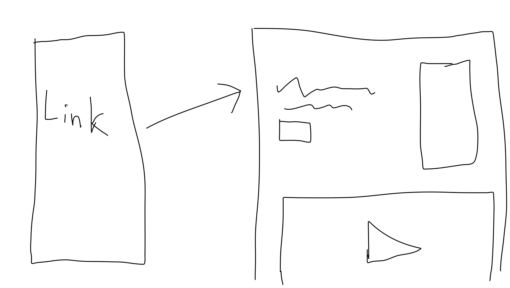

# 37signals junior programmer application

This document outlines my planning, thinking and process behind my application. I'm sharing it to provide context about why my application turned out the way it did. Hopefully it also communicates how I am approaching a project.

---

A few days ago I saw on LinkedIn that dhh were looking for a [Junior Rails Programmer](https://apply.workable.com/37signals/j/A97E298621/). Great! And they are mentioning:
> We're looking for passionate, curious, bright coders who enjoy diving into new technologies and new concepts and who are eager to start their career on this team. 

And also
>Please submit an application with a resumé and a cover letter that tells us about yourself, what you can bring to 37signals, and 37signals’ role in your future. Tell us about something you’ve done, something that’s relevant to the kind of work we do, something that excites you. [...] A generic application won't do. We want to read your unique voice and see some creativity and effort. If it reads like AI slop, it's also going straight into the trash. We have real humans reading your application – we don't use screening software – so speak to them! Tell them why you want to be their next coworker.

This could be a once in a lifetime opportunity, but there are a few challenges:
1. I don't have any Rails experience (but also, it doesn't seem like that is required)
2. Some people will have more experience than me

Unique advantages:
1. I have already read several of 37signal's books, listened to Lenny's podcast where they have appeared, and more. So I know them pretty well
2. They value that programmers have taste - and I have that, especially after working as a PM.
3. They want something that is not generic, and I am pretty creative.
4. They are only looking for people with less than 3 years of professional experience. I only finished my studies last year, so I quality for that (even though I have worked while studying? Well, I didn't work as a programmer so I guess I am good)

## Solution idea
Instead of doing a normal pdf application, I could make a website and also show the process of making it.
So I could share the full github repo and even this document. 

It would work something like this:

The image shows that the application links to a website.

Doing this is a risk, since it takes a lot of work, and who knows - maybe they don't want to click a random link in a pdf? So I should at least also give them the option type it into their browser as well.

But the thing is - they want creativity and effort. So let's do it!

But I am probably not the only one who has thought of this, so I need to stand out even more. 

Some ways I could stand out:
1. Highlight my strengths
2. Show my personality
3. Add some easter eggs to hopefully make them smile or at least remember me
4. Add references to their own products
5. Not use crazy frameworks (I know they are talking a lot about simplicity)
6. NOT USE AI!!!
7. Add a video of myself?
8. Link to one of my youtube videos? 
9. Show that I am able to follow their way of working
10. Host on fly.io (dhh once [tweeted](https://x.com/dhh/status/1632044101418745864) about it)
11. Maybe adding a fun way for them to respond to my application?
12. While going all-in, still keep the website simple, and fast. If I add too many things I am doing the exact opposite of their philosophy!
13. Convert all images to webp?
14. Host images on a cdn?
15. Contribute to an open source project - but isn't that fake if I only do it to impress them? Gotta keep it real.
16. Adding a fake terminal that can execute some fun commands?
17. Dark/light mode toggle - but instead of that, it uses themes that are inspired by 37signal's products
18. Vision page - where I describe what my first 30, 90, 180 days might look like?
19. Write a small application in Rails, to highlight my ability to learn fast
20. Make a LinkedIn ad for my application.

## Starting at the epicenter
While these are good ideas, we need to start with the epicenter, and build around that.

In this case, the epicenter is showing who I am. The most important aspects is:
1. I am willing to go the extra mile
2. I am a great fit for 37signals
3. I have taste in software, especially due to my PM background

Therefore, I will therefore:
1. Just use plain js, html, css - no need for any frameworks or backend
2. Host on github.io - docker seems a bit overkill since there are no dependencies
3. Use references to 37signal's products. Design inspired by Campfire. Review section inspired by HEY. 
4. Show 3 projects
    - One that shows my ability to learn quickly 
    - One that shows that I can build a fullstack application
    - One that shows that I can create a elegant solution to a difficult problem
5. Add a few subtle easter eggs in the code
6. Create a short yet interesting video of myself
7. Create a small rails-project to show my ability to learn how to use that

With this I think I am hitting the sweet spot between being creative, but still keeping it simple and elegant.

## Thank you for reading
I hope you enjoyed getting a view into the thoughts going through my head, as I made the application.

I really hope you want to invite me to the interview - but I also understand that you probably received hundreds of great applications.